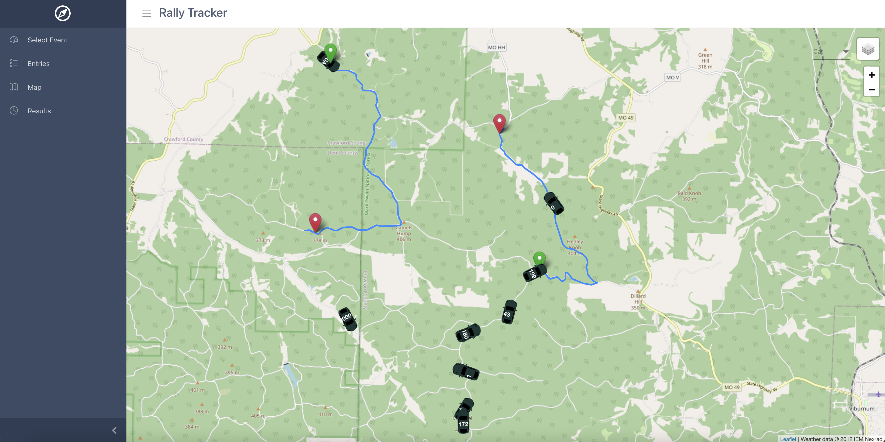
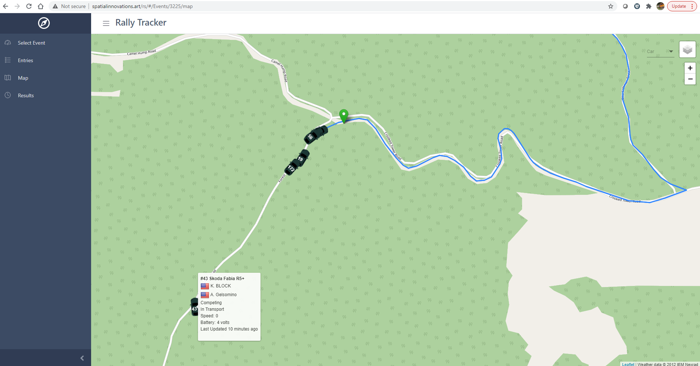
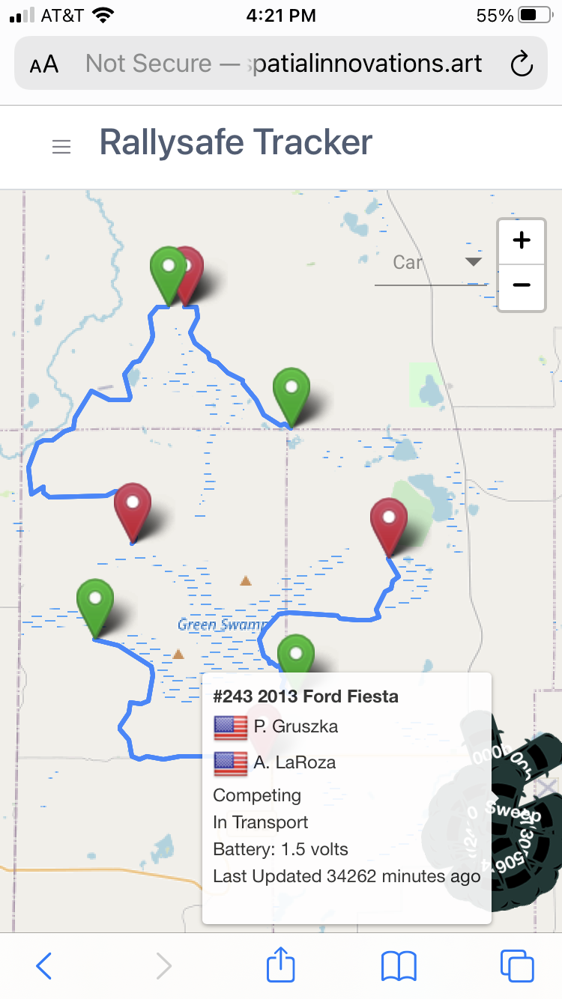
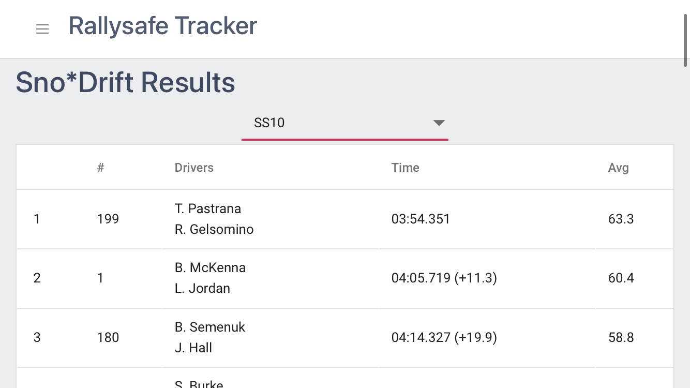

# Rally Tracker

Rally tracker utilizing Vue.js/Leaflet and the rallysafe API.  I wanted to see how quickly I could get a functioning version of a web based tracking app to track rally cars racing in the American Rally Association and view results without having to download an app from the app store.

